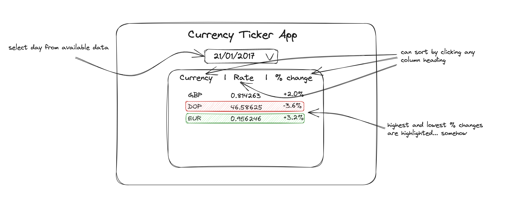

# Currency Ticker

Your task is to create a web app to display and sort data showing currency rates for a selected date. The data is provided for you in a static [currencies.json](./currencies.json) file, and we would like you to create a server to serve this data as well as a front-end web app to interact with it.

Please submit your code as pull request on this repository. (Drop us an email when it's ready).

## Requirements

- The page should display each currency and exchange rate for the selected day, as well as the percentage change of the exchange rate relative to the previous day.
- The user should be able to sort by each of these.
- The currencies with the largest positive and negative rate changes since the previous day should be visually distinguished.

We've mocked up a rough example of what this could look like:



Feel free to apply your own design ideas too.

## Setting up

To get you started, we've provided a skeleton structure which uses similar packages to other apps and services

- Typescript
- [Express](https://expressjs.com)
- [React](https://reactjs.org/) (via [vite](https://vitejs.dev/))

Feel free to add libraries and tooling to suit your own preferences. But please do use React for the client framework, ExpressJS for the server and Typescript in both. This helps our reviewers calibrate our scoring.

## What we're looking for

What we're looking for with this task is:

- Has the task brief been fulfilled? Are all the requirements that were asked for included in the solution?

- A well-structured codebase that's easy to read. Could someone else pick up and work with it? We value readability and maintainability over clever or terse solutions.

- Evidence that you're comfortable working with React, Express and Typescript. Demonstrate that you understand best practices when it comes to building with these tools.

- Tests which prove that your solution works and meets the requirements above. We're not looking for 100% test coverage; tests that prove the app works as intended from a user's perspective are fine.

## Developing

### Installing & running

The provided skeleton is set up with separate `server` and `client` directories, each with `start` and `test` scripts. The project root is set up to run commands on both, ie:

```bash
# Installs both client & server node dependencies
npm install

# Starts both the client & server dev environments
npm start

# Runs both the client & server test suites
npm test
```

### Where things are

By default, the client is ran on http://localhost:3000, the server is ran on http://localhost:3001.

We've set up a `proxy` in the client dev server so any fetch calls will be routed to the server. (See [Vite's documentation](https://vitejs.dev/config/server-options.html#server-proxy))
